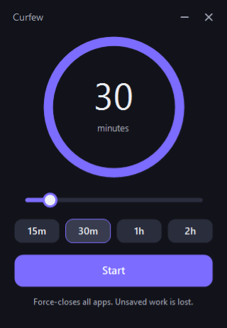

# Curfew

A small Windows desktop app that force-closes every running application and shuts the computer down when a timer runs out.



Single 37 KB executable. No installer, no runtime download, no admin rights.

---

## Features

- Dark indigo theme, borderless window with rounded corners and a live progress ring
- Slider for picking the delay (5 minutes to 3 hours, in 5-minute steps) plus 15m / 30m / 1h / 2h quick presets
- Mouse wheel over the slider nudges the value up or down
- Live countdown in the ring and in the tray tooltip
- Tray icon turns into a draining progress ring while a timer is running; hover it to see the time left, e.g. *Shutdown in 1 h 12 min*
- Idle tray icon is a crescent moon; double-click to reopen, right-click for Show / Cancel shutdown / Exit
- Closing or minimising the window keeps the timer running in the tray
- Cancel at any time, from the main button or the tray menu
- Prompts before exiting while a shutdown is still pending

---

## Technologies used

| Piece | What it's for |
| --- | --- |
| C# (.NET Framework 4.x) | Application language and runtime |
| Windows Forms | Window, tray icon, event loop |
| GDI+ (`System.Drawing`) | Custom-drawn ring, slider, buttons, and the live tray icon — none of the stock WinForms controls are used for the UI |
| DWM API (`dwmapi.dll`) | Windows 11 rounded window corners and border colour |
| User32 API (`user32.dll`) | Dragging the borderless window |
| `shutdown.exe` | The actual shutdown, supplied by Windows |
| `csc.exe` | The C# compiler that ships inside Windows — used by the build script |
| PowerShell | Build script; also generates the app icon at build time |
| No project file | Sources are compiled straight from `src/`, so there is nothing to keep in sync |

There are no NuGet packages, no third-party libraries, and no SDK project files.

---

## Requirements

**To run**

- Windows 10 or Windows 11
- .NET Framework 4.x — already present on every supported Windows install
- No administrator rights (shutting down your own machine does not need them)

Rounded window corners and the custom border need Windows 11. On Windows 10 the app still runs, just with square corners.

**To build**

- Everything above, plus PowerShell 5.1 or newer (also included with Windows)

No Visual Studio or .NET SDK required — the build uses the compiler already sitting in `C:\Windows\Microsoft.NET\Framework64\v4.0.30319`.

---

## Installation

1. Copy `Curfew.exe` anywhere you like, for example `C:\Tools\Curfew\`.
2. Double-click it to run.
3. Optionally right-click the taskbar button and choose **Pin to taskbar**.

Windows 11 hides new tray icons by default. To keep this one visible, open **Settings → Personalisation → Taskbar → Other system tray icons** and switch on *Curfew*, or drag it out of the overflow flyout onto the taskbar.

To start it automatically with Windows, press <kbd>Win</kbd> + <kbd>R</kbd>, enter `shell:startup`, and drop a shortcut to the EXE into the folder that opens.

To uninstall, delete the EXE. The app writes nothing to the registry and creates no files.

---

## Usage

1. Launch **Curfew.exe**.
2. Set the delay — drag the slider, scroll the mouse wheel over it, or click one of the presets.
3. Press **Start**. Windows shows its own warning and the ring begins to drain.
4. The app can be closed to the tray with `–` or `×`; the countdown keeps going. The tray icon shows a ring that empties as time runs out — hover over it for the exact time remaining.
5. To call it off, press **Cancel**, or right-click the tray icon and choose **Cancel shutdown**.
6. To quit the app entirely, right-click the tray icon and choose **Exit**. If a shutdown is still pending you will be asked whether to cancel it as well.

> **Warning:** when the timer reaches zero, applications are closed forcibly. Nothing is asked to save first, so any unsaved work is lost.

---

## Building from source

```powershell
cd path/to/curfew
.\build.ps1
```

The script:

1. Draws `app.ico` with GDI+ as a crescent moon on an indigo tile at eight sizes (16 to 256 px) and writes them into one multi-frame ICO, so the icon stays crisp in the taskbar, Explorer, and Alt-Tab.

   Add `-PreviewPath out.png` to also dump a magnified sheet of every frame on light and dark backgrounds.
2. Invokes `csc.exe` with `/target:winexe` over every `.cs` file in `src/` to produce `Curfew.exe`. Adding a source file needs no build change.

Output on success:

```
Built C:\path\to\curfew\Curfew.exe
```

If PowerShell refuses to run the script, use:

```powershell
powershell -ExecutionPolicy Bypass -File .\build.ps1
```

---

## Project structure

```
curfew/
├── src/
│   ├── Program.cs          Entry point and the single-instance lock
│   ├── MainWindow.cs       The window: layout, timer state, tray wiring
│   ├── Theme.cs            Colour palette, fonts, rounded-rectangle helper
│   ├── PillButton.cs       Rounded button used for presets, the action, the window controls
│   ├── Slider.cs           Drag / wheel slider for picking the delay
│   ├── CountdownRing.cs    Circular progress arc and countdown text
│   ├── Caption.cs          Plain text label, painted to match the theme
│   ├── TrayIcons.cs        Draws the tray artwork; OwnedIcon frees the icon handle
│   ├── TrayIndicator.cs    Owns the NotifyIcon and swaps its icon safely
│   ├── ShutdownCommand.cs  Schedule and cancel, wrapping shutdown.exe
│   └── Duration.cs         Formats minutes and remaining time for display
├── build.ps1               Generates the icon, compiles the EXE
├── app.ico                 Generated at build time
├── Curfew.exe              The built application
├── screenshot.png          Image used in this README
├── LICENSE                 MIT
└── README.md
```

Each file holds one type, named after it. The pieces fit together like this:

- `Program` creates a named mutex so only one copy runs. A second launch posts a
  broadcast message and exits; the running copy catches it and shows its window.
- `MainWindow` owns the state — the chosen delay, whether a timer is armed, and the
  deadline — and does nothing else. Its constructor is split into `BuildHeader`,
  `BuildDial`, `BuildPresets`, `BuildActions` and `BuildTray` so the layout reads top
  to bottom. Every position is a named constant at the top of the file.
- The four controls (`PillButton`, `Slider`, `CountdownRing`, `Caption`) are painted by
  hand and know nothing about shutdowns; each one takes colours from `Theme`.
- `ShutdownCommand` is the only code that touches `shutdown.exe`, and `Duration` is the
  only code that formats a time for the screen.

---

## How it works

Windows already provides everything needed, so the app is a front end for two commands:

| Action | Command |
| --- | --- |
| Arm the timer | `shutdown.exe /s /f /t <seconds>` |
| Cancel | `shutdown.exe /a` |

`/s` shuts down, `/f` forces applications to close without prompting, and `/t` sets the delay in seconds. Because Windows owns the countdown, the shutdown still happens even if the app is closed or crashes — which is also why the app asks before exiting with a timer running.

---

## Licence

MIT. See [LICENSE](LICENSE).
